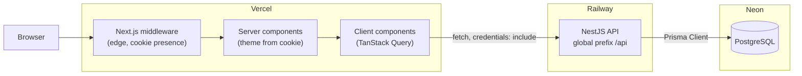
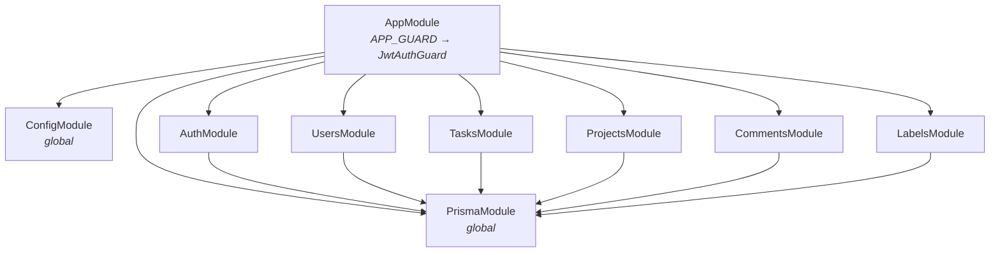
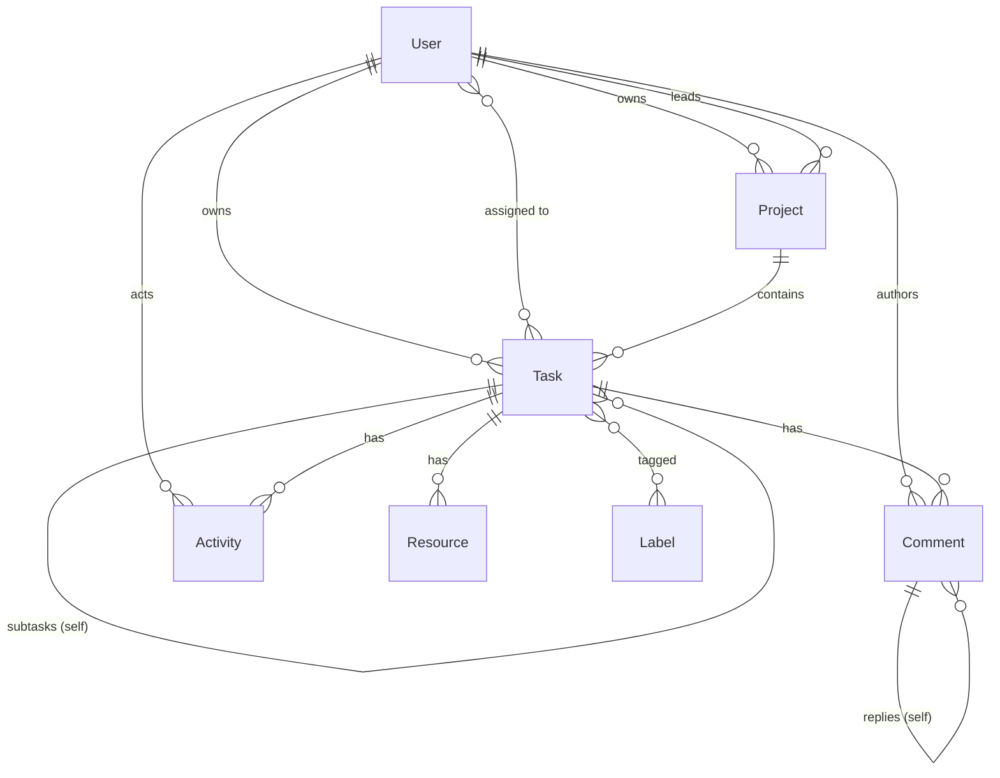
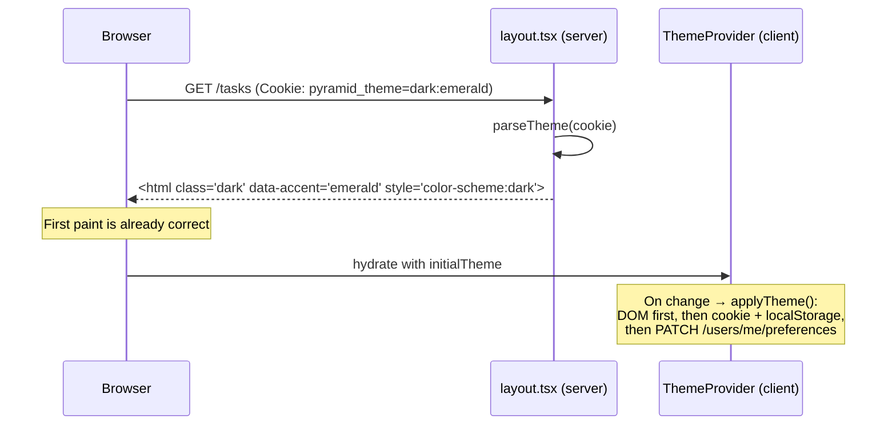
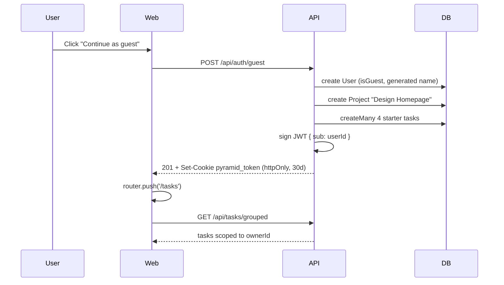
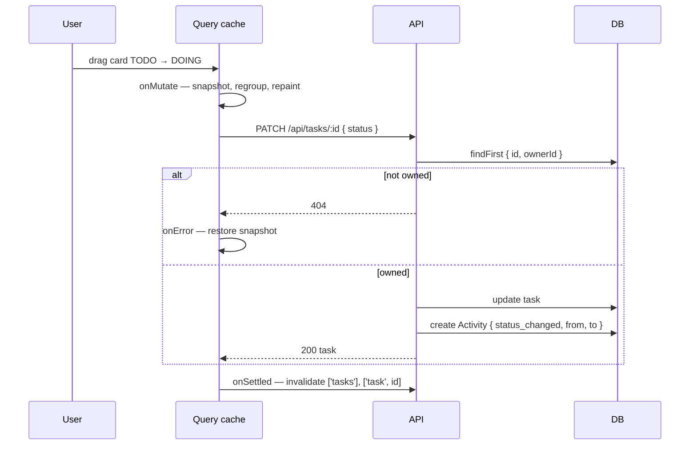

# Architecture — Pyramid

Technical reference for the Pyramid task-management application, built for the
AbleSpace Full Stack Developer assessment from the provided Figma design.

This document covers *how the system is put together and why*. For a feature list,
setup instructions and the record of deliberate deviations from the design, see
[README.md](./README.md).

---

## Contents

1. [System overview](#1-system-overview)
2. [Repository layout](#2-repository-layout)
3. [Technology choices](#3-technology-choices)
4. [Backend architecture](#4-backend-architecture)
5. [Data model](#5-data-model)
6. [API surface](#6-api-surface)
7. [Frontend architecture](#7-frontend-architecture)
8. [Theming architecture](#8-theming-architecture)
9. [Key runtime flows](#9-key-runtime-flows)
10. [Configuration](#10-configuration)
11. [Deployment topology](#11-deployment-topology)
12. [Trade-offs and limitations](#12-trade-offs-and-limitations)

---

## 1. System overview

Three deployable pieces, each on its own host, communicating over HTTPS with a
cookie-based session.



**Boundaries.**

| Boundary | Contract |
|---|---|
| Browser ↔ Web | Server-rendered HTML plus client-side hydration. Theme and session cookies. |
| Web ↔ API | JSON over `fetch`, `credentials: 'include'`. Cross-origin in production. |
| API ↔ DB | Prisma Client. The API is the only writer; no direct DB access from the web tier. |

The web tier holds **no authority**. Middleware performs a cookie-presence check for
routing only — the JWT is httpOnly and signed, so the edge cannot verify it and does
not try. The API validates every request independently and answers `401` when the
token is absent, expired, or points at a user that no longer exists.

---

## 2. Repository layout

npm workspaces monorepo, two packages, no shared package. Types are duplicated
rather than shared — a deliberate call, see [§12](#12-trade-offs-and-limitations).

```
.
├── package.json                  Workspace root; dev/build/db scripts
├── .env.example                  Every variable both apps read
├── README.md                     Features, setup, design deviations
├── ARCHITECTURE.md               This document
└── apps/
    ├── api/                      NestJS 10
    │   ├── prisma/
    │   │   ├── schema.prisma     Single source of truth for the data model
    │   │   ├── migrations/       Versioned SQL
    │   │   └── seed.ts           Demo content matching the design frames
    │   └── src/
    │       ├── main.ts           Bootstrap: prefix, CORS, pipes, filter, Swagger
    │       ├── app.module.ts     Module graph + global auth guard
    │       ├── prisma/           PrismaService (global module)
    │       ├── auth/             Guest login, JWT strategy, guard
    │       ├── users/            Profile + persisted UI preferences
    │       ├── tasks/            CRUD, grouping, filtering, reordering
    │       ├── projects/         CRUD
    │       ├── comments/         Comments and one level of replies
    │       ├── labels/           Label CRUD
    │       └── common/           Exception filter, @Public, @CurrentUser
    └── web/                      Next.js 15 (App Router)
        └── src/
            ├── middleware.ts     Route protection (presence check only)
            ├── app/
            │   ├── layout.tsx    Server component — theme injection, no flash
            │   ├── globals.css   Theme system: 2 modes × 6 accents
            │   ├── (auth)/login/ Public route group
            │   ├── (app)/        Sidebar shell: tasks, task detail, projects
            │   └── settings/     Own shell, per the design
            ├── components/
            │   ├── ui/           Primitives — zero domain knowledge
            │   ├── task/         Task-aware components
            │   └── layout/       Sidebar, page header, user menu
            └── lib/              API client, query hooks, types, theme, format
```

### The component layering rule

`components/ui/` contains no task-specific code and imports nothing from
`lib/types` beyond generic user shapes. Everything that understands tasks lives in
`components/task/`. That boundary is what makes the primitives genuinely reusable
rather than reusable in name — a `<Table>` that knows about `TaskStatus` is not a
table, it is a task list with extra steps.

---

## 3. Technology choices

| Layer | Choice | Rationale |
|---|---|---|
| Frontend | Next.js 15 App Router, React 19 | Server components make the no-flash theme possible; middleware gives route protection without a client redirect. |
| Styling | Tailwind CSS v4, CSS-variable theming | Two theme axes over one token set. Variables let accents swap without recompiling classes. |
| Components | shadcn/ui conventions on Radix | The Figma file *is* the shadcn block library (`Blocks / Login-01`, `Blocks / Sidebar-02`). Matching its conventions is the most accurate and most honest route. |
| Server state | TanStack Query v5 | Cache keys, optimistic writes with precise rollback, request de-duplication. No global store needed. |
| Backend | NestJS 10 | DI and module boundaries keep tenancy enforcement in one layer; decorator metadata drives both the global guard and Swagger. |
| ORM | Prisma 6 | Typed relations, migration history, and a schema file that doubles as data-model documentation. |
| Database | PostgreSQL (Neon) | Relational data with genuine graph shape (self-relations, many-to-many). Neon's free tier suits an assessment. |
| Auth | JWT in an httpOnly cookie | Guest-only per the brief. httpOnly keeps the token out of reach of client JS. |

**Dependencies deliberately not added:** a drag-and-drop library, a date picker, a
toast library, a state-management library. Each was replaced by roughly 150 lines of
fully-understood code. See [§12](#12-trade-offs-and-limitations).

---

## 4. Backend architecture

### 4.1 Module graph



Feature modules depend only on `PrismaModule`. There are no cross-feature service
imports, so no module can be broken by a change in a sibling.

### 4.2 Request lifecycle

```
Request
  → cookie-parser (middleware)
  → JwtAuthGuard          global; bypassed when the handler carries @Public()
      └ JwtStrategy       extracts cookie → falls back to Bearer → loads user
  → ValidationPipe        global; whitelist + forbidNonWhitelisted + transform
  → Controller            @CurrentUser('id') supplies the tenant key
  → Service               applies ownerId scoping, talks to Prisma
  → Response
        ↕
  HttpExceptionFilter     global; catches everything, normalises the shape
```

**Bootstrap** (`main.ts`): global prefix `api`, `cookie-parser`, CORS with
`credentials: true` against a comma-separated `WEB_ORIGIN` allowlist, the global
validation pipe, the global exception filter, then Swagger at `/api/docs`.

### 4.3 Authentication

Guest login only, per the brief.

```
POST /api/auth/guest   creates a guest user, seeds starter content,
                       signs a JWT, sets it as an httpOnly cookie (30 days)
GET  /api/auth/me      returns the session user
POST /api/auth/logout  clears the cookie; 204
```

**Token extraction order** (`jwt.strategy.ts`): cookie first (browsers), then
`Authorization: Bearer` (Swagger and curl). The same guard therefore serves the app
and the interactive docs without a second code path.

**`validate()` re-reads the user on every request.** A signed token can outlive its
subject — a cleared database or a deleted guest — so a token that decodes correctly
but resolves to nothing raises `401 Session no longer valid` rather than admitting a
phantom session.

**Cookie flags** are environment-dependent, because web and API sit on different
domains in production:

| | Development | Production |
|---|---|---|
| `httpOnly` | `true` | `true` |
| `sameSite` | `lax` | `none` |
| `secure` | `false` | `true` |
| `domain` | unset | `COOKIE_DOMAIN` if provided |

`SameSite=None` requires `Secure`; the pair is what lets the cookie survive the
cross-site request from Vercel to Railway.

**Guard-by-default.** `JwtAuthGuard` is registered as `APP_GUARD`, so every route is
protected unless it opts out with `@Public()`. Only `POST /auth/guest` and
`POST /auth/logout` do. Forgetting to protect a new endpoint is not possible; you
have to actively unprotect one.

### 4.4 Authorization and tenancy

Every guest is an isolated tenant. The isolation rule:

> **`ownerId` is applied in the service layer, on every query, without exception.**

```ts
const where: Prisma.TaskWhereInput = {
  ownerId,                                    // never optional
  ...(status && { status }),
  ...(priority && { priority }),
  ...
};
```

Placing this in the service rather than the controller means no controller can
forget it, and no new endpoint can leak by omission. Ownership is verified *before*
mutation as well as during reads:

- `update` / `remove` — `findFirst({ id, ownerId })` first; miss → `404`.
- `reorder` — counts owned ids against submitted ids; any mismatch → `404` for the
  whole batch, so a partial write is impossible.
- Comments — inherit permission from their task via `assertTaskAccess`; deletion
  additionally requires authorship (`403` otherwise).

Unauthorized reads return `404`, not `403`. A guest should not be able to learn that
another guest's task id exists.

### 4.5 Validation

Global `ValidationPipe` with:

| Option | Effect |
|---|---|
| `whitelist: true` | Strips properties with no DTO decorator. |
| `forbidNonWhitelisted: true` | Rejects them instead — malformed clients fail loudly. |
| `transform: true` | Plain payloads become DTO instances. |
| `enableImplicitConversion: true` | Query strings coerce to `number` / `boolean`. |

Every endpoint has an explicit DTO. Mass-assignment is structurally impossible:
`ownerId` and `reporterId` appear on no DTO and are set from the token.

### 4.6 Error contract

`HttpExceptionFilter` is `@Catch()`-all, so *every* error leaves the API in one
shape and the client parses exactly one thing:

```json
{
  "statusCode": 404,
  "error": "NotFound",
  "message": "Task abc not found",
  "path": "/api/tasks/abc",
  "timestamp": "2026-08-08T12:00:00.000Z"
}
```

Non-`HttpException` throws are logged with their stack server-side and returned as a
generic `500` — internals never reach the client. Prisma's `P2002` unique-constraint
violation is translated in `UsersService` into a `409 That username is already taken`,
which is actionable, rather than a `500`, which is not.

### 4.7 Transactions and ordering

- `findAll` runs `findMany` + `count` inside `$transaction` — page and total come
  from one consistent snapshot.
- `reorder` wraps all row updates in `$transaction` — a drag either lands completely
  or not at all.
- New tasks take `min(order) - 1` within their status group, so they appear at the
  **top** of the column, matching the design's `+ Add Task` behaviour, and no
  existing rows need rewriting.
- Sort order is `status → order → createdAt desc`, backed by
  `@@index([ownerId, status, order])`.

---

## 5. Data model

### 5.1 Entity relationships



### 5.2 Enums

| Enum | Values | Source in the design |
|---|---|---|
| `TaskStatus` | `BACKLOG` `TODO` `DOING` `COMPLETED` `ON_HOLD` | Four board columns; `BACKLOG` appears in the detail Status menu. |
| `Priority` | `NONE` `URGENT` `HIGH` `MEDIUM` `LOW` | Priority dropdown. |
| `ThemeMode` | `LIGHT` `DARK` | "Change Theme". |
| `Accent` | `AMBER` `BLUE` `PINK` `ROSE` `EMERALD` `BLACK` | "Color Mode". |
| `ViewMode` | `LIST` `BOARD` | List/Board toggle. |

### 5.3 Modelling decisions

**Subtasks are Tasks.** The design renders subtasks with the identical table
component as top-level tasks. That is a strong signal they are the same entity, so
they are a self-relation (`parentTaskId`) rather than a parallel `Subtask` model.
Consequences: subtasks get status, priority, dates, labels and comments for free;
list queries must exclude them, which `topLevelOnly` (default `true`) does; and
deleting a parent cascades to its children.

**Preferences live on `User`.** `themeMode`, `accent`, `viewMode` and `visibleFields`
are columns, not a side table. They are one-to-one with the user, always read
together with it, and never queried independently. `visibleFields` is `Json` because
its keys are the design's column set and will change with the UI — a schema
migration per column toggle would be the wrong cost.

**`Activity` is an append-only fact table.** It stores `type`, `from`, `to` rather
than rendered sentences, so the "Updates" feed can be relabelled or localised without
a data migration. Rows are written by `TasksService.recordChanges` when status or
priority actually changes, and by `CommentsService` on a top-level comment.

**Comments thread one level.** `parentId` self-relation. The design shows
"Leave a reply…" under a comment but no reply-to-a-reply, so unbounded nesting would
be structure the UI cannot express.

### 5.4 Referential integrity

| Relation | On delete | Reasoning |
|---|---|---|
| `Task.owner`, `Project.owner`, `Comment.author`, `Activity.actor` | `Cascade` | Deleting a guest removes their data entirely. |
| `Task.parent` → subtasks | `Cascade` | A subtask has no meaning without its parent. |
| `Comment.parent` → replies | `Cascade` | Same. |
| `Task.project`, `Task.reporter`, `Project.lead` | `SetNull` | Optional context. Losing a project must not delete its tasks. |
| `Resource.task`, `Comment.task`, `Activity.task` | `Cascade` | Owned wholly by the task. |

### 5.5 Indexes

```
User      @@index([isGuest, createdAt])          guest cleanup / listing
Project   @@index([ownerId, order])              projects table read path
Task      @@index([ownerId, status, order])      the list/board query, exactly
Task      @@index([parentTaskId])                subtask lookup
Task      @@index([projectId])                   project filter
Label     @@unique([ownerId, name])              no duplicate labels per user
Resource  @@index([taskId])
Comment   @@index([taskId, createdAt])           threaded read, newest first
Activity  @@index([taskId, createdAt])           updates feed
```

Every index maps to a query the app actually issues; `[ownerId, status, order]`
mirrors the composite `WHERE` + `ORDER BY` of the main task query.

---

## 6. API surface

Base URL `/api`. Interactive reference at `/api/docs` (Swagger). All routes require
the session cookie except the two marked **public**.

### Auth

| Method | Path | Notes |
|---|---|---|
| `POST` | `/auth/guest` | **public** · 201 · creates guest, seeds content, sets cookie |
| `GET` | `/auth/me` | current session user |
| `POST` | `/auth/logout` | **public** · 204 · clears cookie |

### Users

| Method | Path | Notes |
|---|---|---|
| `GET` | `/users/me` | |
| `PATCH` | `/users/me` | profile — name, title, username; `409` on collision |
| `PATCH` | `/users/me/preferences` | `themeMode`, `accent`, `viewMode`, `visibleFields` |

### Tasks

| Method | Path | Notes |
|---|---|---|
| `GET` | `/tasks` | flat + paginated |
| `GET` | `/tasks/grouped` | pre-grouped by status — powers list and board |
| `POST` | `/tasks` | |
| `PATCH` | `/tasks/reorder` | bulk move/reorder, transactional |
| `GET` | `/tasks/:id` | + subtasks, comments, replies, activity (20), resources |
| `PATCH` | `/tasks/:id` | writes `Activity` rows on status/priority change |
| `DELETE` | `/tasks/:id` | |

Query parameters on both list endpoints:

| Param | Type | Default | Effect |
|---|---|---|---|
| `status` | `TaskStatus` | — | exact match |
| `priority` | `Priority` | — | exact match |
| `search` | `string` | — | case-insensitive over title + description |
| `projectId` | `string` | — | exact match |
| `topLevelOnly` | `boolean` | `true` | `false` includes subtasks |
| `page` / `limit` | `number` | `1` / `50` | `grouped` overrides `limit` to 200 |

> **Route-order note.** `@Patch('reorder')` is declared *before* `@Patch(':id')`.
> Nest matches in declaration order; reversed, `reorder` would be swallowed as an id.

### Projects · Comments · Labels

| Method | Path | Notes |
|---|---|---|
| `GET` | `/projects` | `?search=` |
| `POST` | `/projects` | |
| `GET` `PATCH` `DELETE` | `/projects/:id` | |
| `GET` | `/tasks/:taskId/comments` | top-level + nested replies |
| `POST` | `/tasks/:taskId/comments` | `parentId` optional |
| `DELETE` | `/comments/:id` | author only, else `403` |
| `GET` `POST` | `/labels` | |
| `DELETE` | `/labels/:id` | |

---

## 7. Frontend architecture

### 7.1 Route map

```
/                        redirect
/login                   (auth) group — public
/tasks                   (app) group — list + board views
/tasks/[id]              (app) group — task detail
/projects                (app) group — projects table
/settings                own shell, per the design
```

Route groups carry the shell. `(app)/layout.tsx` provides the sidebar; `/settings`
sits outside it because the design gives it a different chrome. Middleware redirects
an unauthenticated request to `/login`, and an authenticated request *away* from
`/login` to `/tasks`. Its matcher excludes `_next/*`, `favicon.ico` and `icon.svg` —
without the last exclusion the login page would request an icon it is not allowed
to fetch.

### 7.2 Server / client boundary

Server components are used where they earn their place:

- **`app/layout.tsx`** reads the theme cookie and writes `class` / `data-accent` /
  `color-scheme` onto `<html>` in the first byte of the response.
- Everything interactive is a client component, marked `'use client'`.

There is no server-side data fetching for tasks. The session is an httpOnly cookie
scoped to the API's origin, and the data is user-specific and mutation-heavy — a
client cache with optimistic writes is the better fit than per-navigation server
round trips.

### 7.3 Data layer

```
components  →  lib/queries.ts  →  lib/api.ts  →  API
              (TanStack Query)   (fetch wrapper)
```

`lib/api.ts` is a thin typed wrapper. Two details matter:

- **`credentials: 'include'` on every call.** The session is an httpOnly cookie; a
  call without it is anonymous.
- **`ApiError` carries `status`.** That is what lets the retry policy distinguish
  "will never succeed" from "might".

`QueryClient` defaults (`components/providers.tsx`):

| Option | Value | Reasoning |
|---|---|---|
| `staleTime` | 30 s | Navigation between views does not refetch. |
| `refetchOnWindowFocus` | `false` | Alt-tabbing is not a data event. |
| `retry` | 0 for `401`/`403`/`404`, else 2 | An auth failure will not fix itself. |

The client is created inside `useState` so it is per-session and never shared across
requests during SSR.

**Query keys** are centralised in `queryKeys`, with filters folded into the tasks key
(`['tasks', filters]`). Broad invalidation on `['tasks']` therefore covers every
filter combination currently in cache.

### 7.4 Optimistic updates

`useUpdateTask` and `useDeleteTask` write to the cache before the network call:

```
onMutate   cancelQueries → snapshot every ['tasks'] entry → rewrite the cache
onError    restore each snapshotted key verbatim
onSettled  invalidate ['tasks'] and ['task', id] — server has the last word
```

The rewrite in `onMutate` **regroups**, not just patches: all tasks are flattened,
the target is updated, and each is re-bucketed by its (possibly new) status. That is
what makes a status change move the row between groups instantly rather than
updating a badge in place. Dragging a card feels immediate because the round trip
happens behind the change, not in front of it.

Rollback restores the exact snapshot rather than refetching, so a failure cannot
leave a half-applied state on screen.

Reads that change on every keystroke — the search box, the projects list — use
`placeholderData: keepPreviousData`, so the table holds its previous rows instead of
flashing empty. Search input is additionally debounced (300 ms) by `useDebounced`.

### 7.5 Preference persistence

View mode and column visibility are stored in three places, each for a reason:

| Tier | Purpose |
|---|---|
| React state | Drives the current render. |
| `localStorage` | Correct first paint before the network responds. |
| `User` row via API | The preference follows the account, not the browser. |

`usePreferences` reads `localStorage` in an effect — deliberately after mount, since
reading it during render would desynchronise server and client markup — then
reconciles with the server value once `useMe()` resolves. Writes go to both tiers.

### 7.6 Drag and drop

The board uses the **native HTML5 drag API**: no dependency, and full desktop
coverage. Native DnD is unreliable on touch, so every move is also reachable from the
card's `…` menu — which is what touch and keyboard users actually get. A drop issues
one `PATCH /tasks/reorder` for the whole affected set.

---

## 8. Theming architecture

The design exposes two independent controls: **Change Theme** (Light / Dark) and
**Color Mode** (Amber, Blue, Pink, Rose, Emerald, Black). That is 12 combinations,
implemented as **two axes, not twelve palettes**.

```
:root                       neutral scale — light      ┐
.dark                       neutral scale — dark       ┘  mode axis

[data-accent="blue"]        accent tokens — light      ┐
.dark[data-accent="blue"]   accent tokens — dark       ┘  accent axis  (× 6)

@theme inline               tokens → Tailwind utilities
```

Adding a seventh accent is one pair of blocks. Adding a third mode would be one.
Neither multiplies against the other.

### No flash on load



The cookie value is a compact `mode:accent` pair (`"dark:emerald"`), parsed with
per-field validation so a hand-edited cookie degrades to the default rather than
rendering an undefined accent. `localStorage` is mirrored as a client-side fallback;
writes are wrapped in `try/catch` because private browsing can throw, and the cookie
is the source of truth so a failure there is not worth surfacing.

The preference is also written to the `User` row, so it follows the account rather
than the browser.

---

## 9. Key runtime flows

### 9.1 Guest login



Starter content exists so the app never opens on an empty screen — an empty board is
a poor first impression and a poor demonstration.

### 9.2 Status change from the board



### 9.3 Logout

`POST /auth/logout` clears the cookie server-side; `onSuccess` calls
`queryClient.clear()`. Dropping the cache matters: without it, the next guest to sign
in on the same browser could read the previous one's tasks straight out of memory
before the first refetch lands.

---

## 10. Configuration

All variables are documented in `.env.example`. The API reads `apps/api/.env`; the
web app reads `apps/web/.env.local`.

### `apps/api`

| Variable | Required | Purpose |
|---|---|---|
| `DATABASE_URL` | yes | PostgreSQL connection string (`sslmode=require` on Neon). |
| `JWT_SECRET` | yes | Signing key. Falls back to an insecure dev value — **set it in production.** |
| `JWT_EXPIRES_IN` | no | Token lifetime, default `30d`. |
| `PORT` | no | Default `4000`. |
| `WEB_ORIGIN` | yes in prod | Comma-separated CORS allowlist. |
| `COOKIE_DOMAIN` | no | Set when web and API share a parent domain. |
| `NODE_ENV` | yes in prod | `production` switches the cookie to `SameSite=None; Secure`. |

### `apps/web`

| Variable | Required | Purpose |
|---|---|---|
| `NEXT_PUBLIC_API_URL` | yes | API origin. Public by necessity — it is a URL, not a secret. |

No secret is exposed to the browser. The JWT is httpOnly and never enters the
JavaScript context.

---

## 11. Deployment topology

| Piece | Host | Build | Start |
|---|---|---|---|
| Web | Vercel | `next build` | Vercel runtime |
| API | Railway | `prisma generate && nest build` | `prisma migrate deploy && node dist/main` |
| DB | Neon | — | — |

Migrations run on API start (`start:prod`), so a deploy cannot serve code against a
schema it does not expect.

### Local development

```bash
npm install

cp .env.example apps/api/.env        # set DATABASE_URL and JWT_SECRET
cp .env.example apps/web/.env.local

npm run db:generate
npm run db:migrate
npm run db:seed                      # optional demo content

npm run dev:api                      # :4000  — docs at /api/docs
npm run dev:web                      # :3000
```

Workspace scripts (`db:*`, `dev:*`, `build`) are defined at the root and delegate to
`apps/*`, so day-to-day commands never require changing directory.

---

## 12. Trade-offs and limitations

### Decisions taken deliberately

**No shared types package.** Two workspaces would need a third for shared types, plus
build ordering and a watch-mode story. For a surface this size, `lib/types.ts` mirrors
the API shapes by hand. The cost is real — a schema change touches two files — and it
is the first thing to fix if the project grew.

**No drag-and-drop library.** Native HTML5 DnD covers desktop with zero dependency
weight. The gap on touch is closed by the card's `…` menu rather than by importing a
library, which also gives keyboard users a path.

**Hand-written calendar and toasts.** Both are small, single-purpose and fully
understood — preferable to two more dependencies for ~150 lines of behaviour.

**Guest-only auth.** Per the brief. The structure — global guard, `@Public()`
opt-out, `ownerId` scoping in services — is exactly what a real provider would plug
into; only `AuthService.loginAsGuest` would be replaced.

**404 over 403 for another tenant's resource.** Slightly less precise; does not
confirm that an id exists.

### Known limitations

- **No test suite.** With more time: unit tests on `TasksService` ownership scoping
  and the theme cookie round trip, plus a Playwright pass over
  guest login → create → move → theme change.
- **Assignee and label pickers are read-only in the UI.** The API supports writing
  both (`assigneeIds`, `labelIds` on task create/update); only the pickers are missing.
- **Board column order is fixed.** Columns are not reorderable.
- **`findGrouped` caps at 200 tasks** and does not paginate. Correct for the assessment's
  data volume; a real workspace would need per-column pagination or virtualisation.
- **Guest rows are never garbage-collected.** Every visit creates a `User`. The
  `@@index([isGuest, createdAt])` exists so a cleanup job can be added cheaply, but
  no such job runs.
- **Activity records status and priority only.** Title, date and assignee edits are
  not tracked.

---

*Companion document: [README.md](./README.md) — features, setup, and the record of
intentional deviations from the Figma design.*
